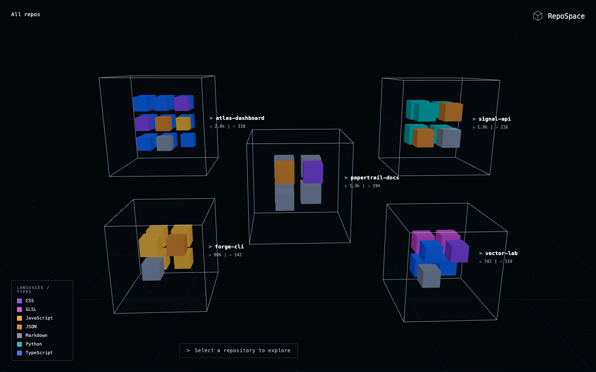
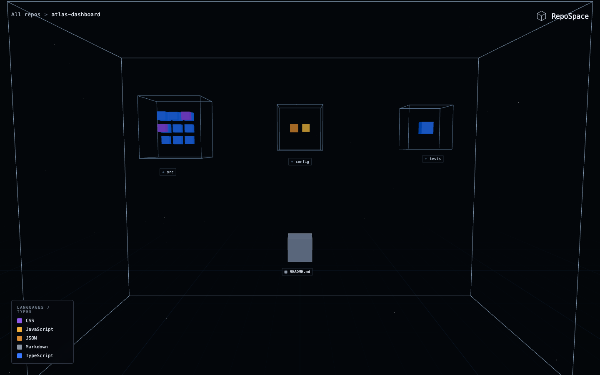
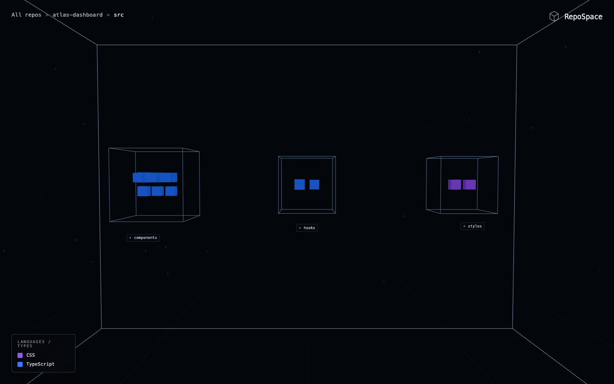
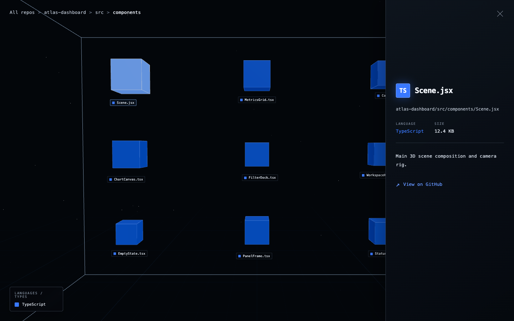
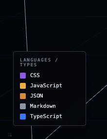

# RepoSpace

<p align="center">
  <strong>An interactive 3D map of GitHub repositories.</strong>
</p>

<p align="center">
  <a href="https://react.dev/"></a>
  <a href="https://threejs.org/"></a>
  <a href="https://docs.pmnd.rs/react-three-fiber"></a>
  <a href="https://vite.dev/"></a>
  <a href="https://docs.github.com/en/rest"></a>
  <a href="https://developer.mozilla.org/en-US/docs/Web/JavaScript"></a>
</p>



RepoSpace is a creative coding and data visualization project that turns a
GitHub profile into an explorable 3D environment. Repositories appear as
wireframe cubes. Folders become navigable containers, and every file is rendered
as an individual block sized by its file size and colored by its language or
extension.

The project explores whether a repository can be read spatially rather than as
a flat list. It is intentionally minimal: a dark interface, restrained motion,
faithful file trees, and clear navigation.

## Preview

| Repository interior | Folder view |
| --- | --- |
|  |  |

| File metadata panel | Dynamic language legend |
| --- | --- |
|  |  |

## Core Features

- Fetches public repositories, metadata, language breakdowns, and Git trees
  from the GitHub REST API.
- Preserves repository fidelity: one real file always produces one visible
  block. No decorative filler blocks are generated.
- Supports repository, folder, subfolder, and file navigation with accurate
  breadcrumbs.
- Uses adaptive multi-row and multi-column layouts to keep dense repositories
  readable inside a fixed wireframe space.
- Sizes file blocks by file size and folder shells by descendant content.
- Assigns consistent colors to recognized languages and file extensions, with a
  neutral fallback only for unknown types.
- Builds the legend dynamically from the blocks visible in the current view,
  including real preview blocks inside visible folder shells.
- Provides smooth camera transitions, subtle hover feedback, and a focused file
  metadata panel with direct GitHub links.
- Falls back to bundled representative data when the GitHub API is unavailable
  or rate limited.

## Tech Stack

| Layer | Technology |
| --- | --- |
| Application | React, JavaScript ES modules |
| Build tooling | Vite |
| 3D rendering | Three.js, React Three Fiber, Drei |
| State management | Zustand |
| UI motion | Framer Motion |
| Data source | GitHub REST API |
| Testing | Vitest, Testing Library |

## Getting Started

### Prerequisites

- Node.js 20 or newer
- npm
- A modern desktop browser with WebGL support

### Installation

```bash
git clone https://github.com/Brainfkt/RepoSpace.git
cd RepoSpace
npm install
cp .env.example .env
npm run dev
```

Open [http://127.0.0.1:5173](http://127.0.0.1:5173) in your browser. RepoSpace is
currently designed for desktop exploration and displays a wider-screen notice
below `900px`.

## Environment Variables

The browser integration only needs public, frontend-safe configuration:

```bash
VITE_GITHUB_USERNAME=Brainfkt
VITE_GITHUB_API_BASE_URL=https://api.github.com
```

| Variable | Purpose |
| --- | --- |
| `VITE_GITHUB_USERNAME` | GitHub profile whose public repositories should be visualized. |
| `VITE_GITHUB_API_BASE_URL` | GitHub REST API base URL, or a server-side proxy URL if one is added later. |

Copy [.env.example](./.env.example) to `.env` and change
`VITE_GITHUB_USERNAME` to visualize another public profile.

## GitHub API Setup

Public repositories work without authentication. The application requests:

```text
GET /users/{username}/repos
GET /repos/{owner}/{repo}/languages
GET /repos/{owner}/{repo}/git/trees/{ref}?recursive=1
```

When GitHub truncates a recursive tree response, RepoSpace recovers the complete
tree subtree by subtree before rendering it.

Do **not** place a GitHub token in any `VITE_*` variable. Vite exposes those
values to browser code. For private repositories or higher rate limits, add a
server-side proxy, point `VITE_GITHUB_API_BASE_URL` to that proxy, and keep
`GITHUB_TOKEN` only in the server environment.

## Project Structure

```text
src/
├── api/                    # GitHub REST client and normalization
├── components/             # 3D scene, cubes, blocks, legend, and panels
├── config/                 # Frontend-safe GitHub configuration
├── constants/              # Language and file-type color system
├── data/                   # Bundled fallback repositories
├── store/                  # Repository and navigation state
└── utils/                  # Tree traversal, layout, sizing, and formatting

public/
└── screenshots/            # README preview images
```

## Available Scripts

| Command | Description |
| --- | --- |
| `npm run dev` | Start the Vite development server. |
| `npm run build` | Build the production bundle. |
| `npm run preview` | Preview the production build locally. |
| `npm test` | Run the Vitest suite. |

## Future Improvements

- Add an optional server-side GitHub proxy for authenticated requests and
  private repositories.
- Add repository filtering and search for profiles with large project lists.
- Add richer file metrics such as line counts and commit activity.
- Introduce URL-backed navigation for shareable repository and folder views.
- Continue profiling dense repositories and split the 3D bundle further where
  it improves load time.

## Author

Created by [Brainfkt](https://github.com/Brainfkt).

RepoSpace is a portfolio project focused on creative frontend engineering,
interactive data visualization, and practical WebGL interface design.
